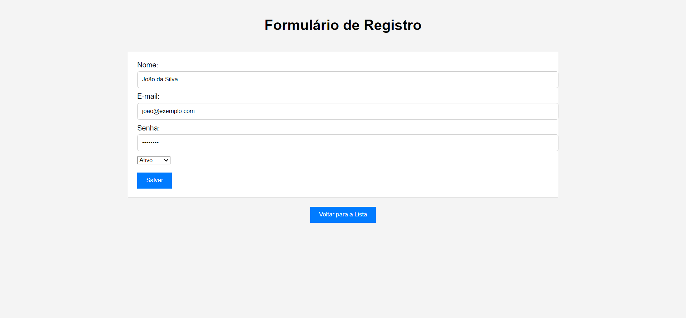

# Desafio IATECAM

Um CRUD simples para criar, ler, atualizar e excluir registros de uma tabela.

## Funcionalidades

- **Novo Registro**: Adicione novos registros à tabela.
- **Listar Registros**: Veja todos os registros cadastrados.
- **Atualizar Registros**: Edite o nome, e-mail, senha ou o status de um registro existente.
- **Excluir Registro**: Remova registros da tabela.

## Tecnologias

- **HTML**
- **CSS**
- **JavaScript**

## Projeto

Veja o projeto completo: <a href="https://marcusv227.github.io/Desafio_IATECAM/">Desafio</a>